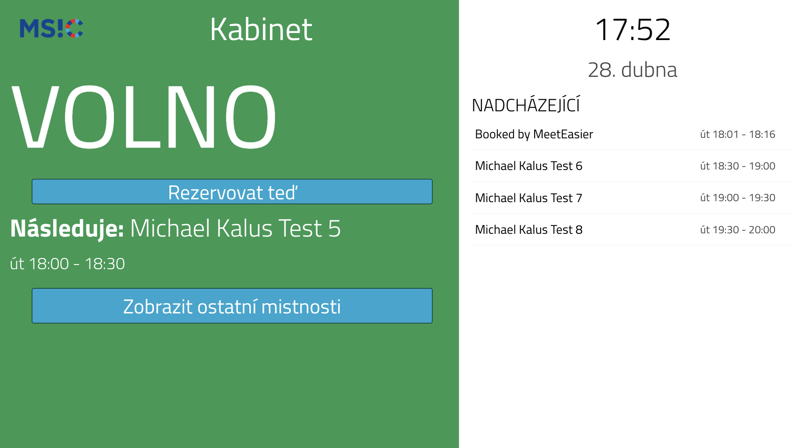
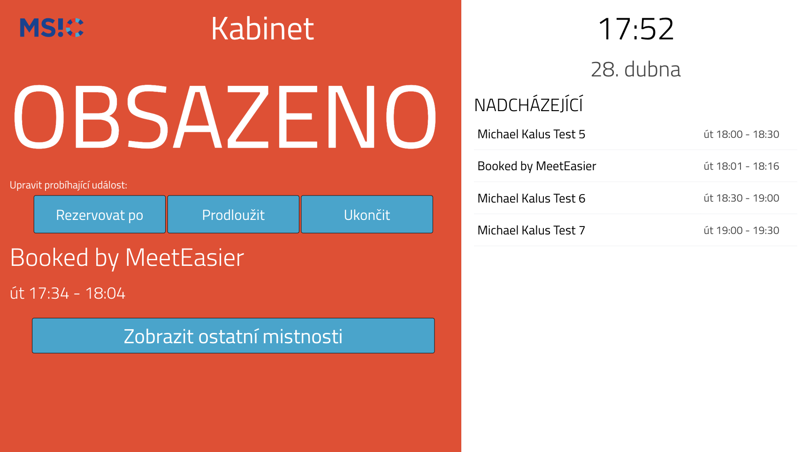
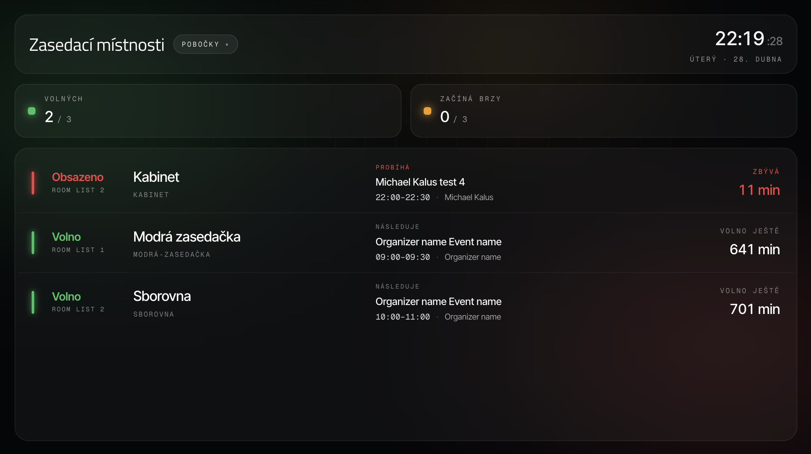
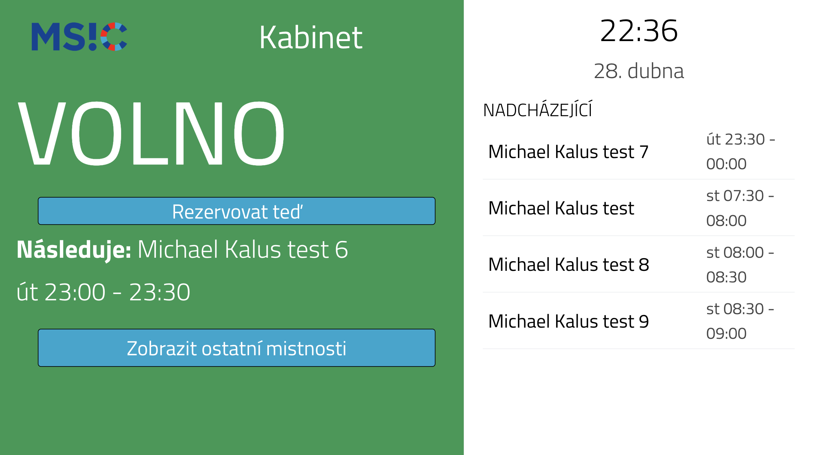
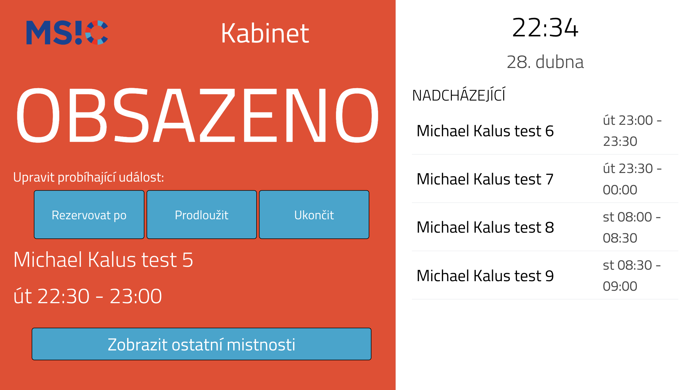

# MeetEasier

Web app that visualizes meeting room availability for Microsoft 365 / Exchange Online. This is a customized fork that **uses Microsoft Graph API + OAuth** instead of the legacy EWS basic-auth flow used by the upstream project.



This fork is based on [danxfisher/MeetEasier](https://github.com/danxfisher/MeetEasier). Earlier history also incorporates fixes lifted from [Collie147/MeetEasier](https://github.com/Collie147/MeetEasier), [tomaskovacik/MeetEasier](https://github.com/tomaskovacik/MeetEasier) (EWS revival) and [probits-as/MeetEasier `feat/roombooking`](https://github.com/probits-as/MeetEasier/tree/feat/roombooking) (booking handler).

## Highlights of this fork

- **Microsoft Graph API** as primary backend (`app/msgraph/`) with EWS retained as legacy fallback
- **OAuth 2.0 client credentials** flow via `@azure/msal-node` — no shared mailbox passwords
- All credentials loaded from `.env` (no hardcoded fallbacks)
- Extra UI components: back button, room search, booking modal, single-room display variants
- **Glass design 2026** — OLED-friendly dark UI with ambient glow tinted by status, blurred glass cards and Inter Tight + Geist Mono typography. Build-time toggle (`REACT_APP_UI_VARIANT`) keeps the legacy *Classic* layout available for e-ink or low-power displays.
- Cleaned up `.gitignore` so secrets, MSAL token cache, and editor backups never leave your machine

## Booking from the single-room display

The single-room layout can show **Book / Extend / End meeting** buttons. They call Microsoft Graph (`bookRoom` in `app/msgraph/graph.js`) and require the Azure AD app to have `Calendars.ReadWrite` permission in addition to `Calendars.Read`.

Booking UI is **off by default** — set `REACT_APP_BOOKING_ENABLED=true` in `ui-react/.env` before running `npm run build` to enable it. Useful only on touchscreen displays; for passive read-only screens leave it disabled.

The booking handler is adapted from [probits-as/MeetEasier feat/roombooking](https://github.com/probits-as/MeetEasier/tree/feat/roombooking) and should be considered beta — please verify the flow against your tenant before relying on it in production.

## Tech stack

- **Backend:** Node.js (≥ 18, tested on 20 LTS), Express, Socket.IO
- **Auth:** `@azure/msal-node` (Graph) or `ews-javascript-api` (legacy)
- **Frontend:** React (Create React App)
- **Process manager:** PM2 (recommended) or systemd

## Prerequisites

- Microsoft 365 tenant with conference-room mailboxes organized in **room lists**
- An [Azure AD app registration](https://learn.microsoft.com/en-us/graph/auth-register-app-v2) with application permissions:
  - `Place.Read.All`
  - `Calendars.Read`
  - `Calendars.ReadWrite` *(only if you enable booking from the single-room display — see below)*

  See [MSAL.md](MSAL.md) for a step-by-step walkthrough including the PowerShell commands to create room mailboxes and room lists.
- A web server with Node.js installed
- Reverse proxy with TLS (nginx / Caddy / IIS) is strongly recommended for production

## Installation

```bash
git clone https://github.com/kalus-msic/MeetEasier.git
cd MeetEasier
cp .env.template .env
$EDITOR .env                          # fill in OAUTH_* and DOMAIN
cp ui-react/.env.example ui-react/.env
$EDITOR ui-react/.env                 # toggle REACT_APP_* flags
npm ci          # installs backend deps; postinstall hook also installs ui-react deps
npm run build   # builds the React frontend (delegates to ui-react)
```

## Running

### Development
```bash
npm start                             # backend on PORT
npm run start-ui-dev                  # CRA dev server with hot reload
```

### Production with PM2
```bash
pm2 start server.js --name meeteasier
pm2 save
pm2 startup                           # follow the printed sudo command
```

## Configuration

### Environment variables (`.env`)

| Variable | Description |
|---|---|
| `OAUTH_CLIENT_ID` | Azure AD app registration client ID |
| `OAUTH_AUTHORITY` | `https://login.microsoftonline.com/<tenant-id>` |
| `OAUTH_CLIENT_SECRET` | Client secret **value** (not the secret ID) |
| `DOMAIN` | Mail domain used for room mailboxes (e.g. `contoso.com`) |
| `SEARCH_USE_GRAPHAPI` | `true` (recommended) — set `false` to fall back to EWS |
| `SEARCH_MAXROOMLISTS` | Max number of room lists to fetch (default `10`) |
| `SEARCH_MAXDAYS` | Max number of days to look ahead (default `10`) |
| `SEARCH_MAXITEMS` | Max meetings per room (default `6`) |
| `PORT` | HTTP port (default `8080`) |
| `EWS_USERNAME`, `EWS_PASSWORD`, `EWS_URI` | Only needed when `SEARCH_USE_GRAPHAPI=false` (legacy) |

### Frontend variables (`ui-react/.env`)

Create React App reads its own `.env` from the `ui-react/` directory at **build time** and bakes the values into the JS bundle. Backend OAuth secrets must never go here.

| Variable | Description |
|---|---|
| `REACT_APP_ROOMLIST` | Show the room-list dropdown in the flightboard navbar (`true`/`false`) |
| `REACT_APP_BOOKING_ENABLED` | Show Book / Extend / End meeting buttons on the single-room display (`true`/`false`) |
| `REACT_APP_UI_VARIANT` | UI variant: `glass` (default, OLED dark Glass design 2026) or `classic` (legacy flightboard + single-room layout, e.g. for e-ink) |

### Room blacklist

Exclude specific rooms from the display in `config/room-blacklist.js`:

```js
module.exports = {
  roomEmails: ['boardroom@contoso.com']
};
```

### UI customization

- Logo: replace `static/img/logo.png`
- All on-screen labels live in two config files — edit them and rebuild to translate the displays into English (or any other language):
  - `ui-react/src/config/flightboard.config.js` — dashboard top bar, branch (Pobočky) filter, summary cards, per-room list, **plus shared `days[]` / `months[]` arrays** (used by both variants).
  - `ui-react/src/config/singleRoom.config.js` — single-room view (status words, hero "who & when" labels, time band, booking buttons, popup messages, agenda, back link).

  Both files have a `glass:` block (Glass UI 2026) and root-level keys (Classic legacy layout) — translate only the block matching the variant you ship. After editing, run `npm run build` and restart PM2; the labels are baked into the bundle at build time.

## Folder structure

```
app/
  ews/         legacy Exchange Web Services routes
  msgraph/     Microsoft Graph routes (default)
  routes.js    chooses Graph or EWS based on SEARCH_USE_GRAPHAPI
  socket-controller.js
config/
  config.js          MSAL + EWS settings, all values from .env
  room-blacklist.js
data/
  cache.json         MSAL token cache (gitignored)
mockups/
scss/                global SCSS sources
static/              public assets
ui-react/
  src/components/
    flightboard/   meeting-list ("flightboard") layout
    single-room/   single-room display
    global/        shared
  src/config/      runtime configuration
  src/layouts/
server.js
```

## Display compatibility

The UI is optimized for **HD (1280×720) panels** — typical for office meeting-room displays and tablets mounted next to doors. Most font sizes are defined in `vw` units, so the layout scales reasonably to other resolutions, but on significantly different aspect ratios you may want to adjust the typography in `static/css/styles.css` (search for `font-size`) and in the SCSS sources under `scss/`.

## Layouts

Two visual variants ship in the same bundle. Pick one with `REACT_APP_UI_VARIANT` in `ui-react/.env` (default `glass`) and rebuild.

### Glass (default)

OLED-black background with ambient bloom that tints the page based on status. Single-room view leads with a "who & when" hero block — organizer name and avatar, full time range, and remaining/start countdown — followed by a clock and an upcoming-events agenda. The dashboard shows a glass top bar with a self-contained branch (Pobočky) dropdown, a status summary, and a per-room list that links through to each room.

| Single room — free | Single room — busy |
|---|---|
|  |  |

Dashboard (overview of all rooms):



Fonts (Inter Tight + Geist Mono) are loaded from Google Fonts at runtime, so the displays need internet access on first load — they cache afterwards.

### Classic (legacy)

Original flightboard table and single-room status block. Useful for e-ink or low-contrast displays where translucent glass cards don't render well.

| Single room — free | Single room — busy |
|---|---|
|  |  |

## Updating

```bash
cd /opt/MeetEasier
git pull origin master
npm ci          # installs backend deps; postinstall hook also installs ui-react deps
npm run build   # builds the React frontend (delegates to ui-react)
pm2 restart meeteasier
```

## License

Released under [GPL 3.0](https://github.com/danxfisher/MeetEasier/blob/master/LICENSE), inherited from the upstream project.

## Credits

- Original project: [danxfisher/MeetEasier](https://github.com/danxfisher/MeetEasier)
- Patches lifted into this fork:
  - [Collie147/MeetEasier](https://github.com/Collie147/MeetEasier) — earlier customizations
  - [tomaskovacik/MeetEasier](https://github.com/tomaskovacik/MeetEasier) — EWS fixes after upstream EWS broke
  - [probits-as/MeetEasier `feat/roombooking`](https://github.com/probits-as/MeetEasier/tree/feat/roombooking) — single-room booking handler
- Graph API references: [`@microsoft/microsoft-graph-client`](https://github.com/microsoftgraph/msgraph-sdk-javascript), [`@azure/msal-node`](https://github.com/AzureAD/microsoft-authentication-library-for-js)
